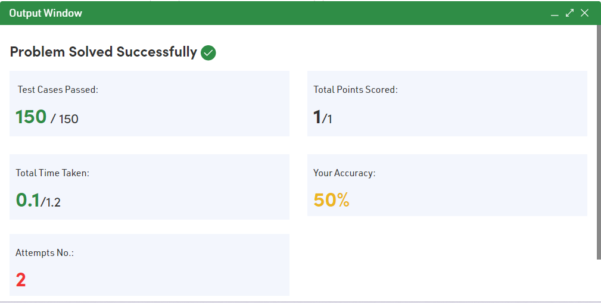
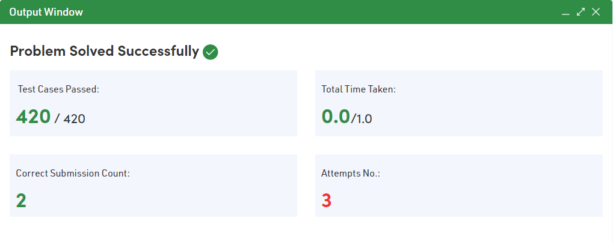
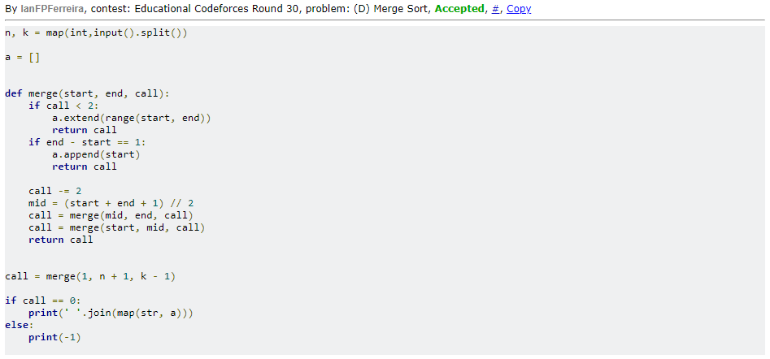
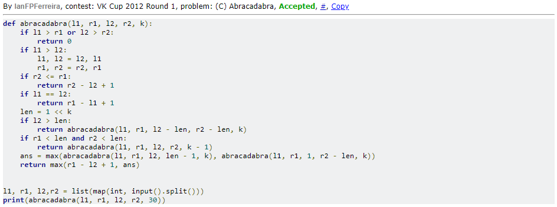

# D-C_Dupla17

**Número da Lista**: 4<br>
**Conteúdo da Disciplina**: Dividir e Conquistar<br>

## Alunos
|Matrícula | Aluno |
| -- | -- |
| 18/0096991  |  Álvaro Leles Guimarães |
| 18/0102087  |  Ian Fillipe Pontes Ferreira |

## Sobre 
Esse projeto tem como objetivo mostrar a utilização de algoritmos com a abordagem de dividir e conquistar resolvendo problemas de programação competitiva. Para isso resolvemos 4 problemas pertencentes a 2 juízes onlines diferentes:

- GeeksforGeeks
- CodeForces

O funcionamento do projeto se dá com a execução de cada arquivo, passando como valores de entrada os exemplos de cada problema, que se encontra nos links que há dentro de cada arquivo.py neste repositório.

## Screenshots

| | |
:---------: | :------: |
| Accepted do GeeksforGeeks | Accepted do GeeksforGeeks |
|  |  |
| Accepted do Codeforces | Accepted do Codeforces |
|  |  |

## Instalação 
**Linguagem**: Python<br>
**Pré-requisitos**: Para rodar o projeto é necessário ter o Python instalado na versão 3.8.5, que foi a versão utilizada, ou uma versão superior. Acesse <a href="https://www.python.org" target="_blank">aqui</a> para instalar o Python.

### **1. Clonar o repositório:**

```python
git clone https://github.com/projeto-de-algoritmos/D-C_Dupla17.git
```

### **2. Executar os códigos:**

Com o python instalado execute um dos comandos a seguir estando com o terminal na pasta raiz do repositório.

- Windows:

```
python Abracadabra.py
```

```
python BinarySearch.py
```

```
python MergeSort.py
```

```
python PowerOfNumbers.py
```

- Linux

```
python3 Abracadabra.py
```

```
python3 BinarySearch.py
```

```
python3 MergeSort.py
```

```
python3 PowerOfNumbers.py
```

## Outros 
Quaisquer outras informações sobre seu projeto podem ser descritas abaixo.

### BinarySearch.py

Esse problema demonstra uma das funções mais conhecidas para algoritmos de dividir e conquistar que é sua utilização no algoritmo da busca binária. Algoritmos de busca lineares tem como complexidade O(n), enquanto que o de busca binária, utilizando-se do princípio de dividir e conquistar tem complexidade O(Log n). A solução desse problema foi então escrever o algoritmo de busca binária, já que o problema já disponibilizava o código de leitura das variáveis.

### PowerOfNumbers.py

Neste problema, dado um número e seu reverso, deveria ser encontrado o valor do número elevado ao seu reverso módulo 1000000007 (devido ao quão grande poderia ser o resultado). Para resolvê-lo, foi utlizado o princípio de dividir e conquistar onde caso o valor de potenciação (o reverso) fosse par, a função é chamada novamente de forma recursiva mas passando metade do valor de potenciação, otimizando assim o tempo do algoritmo.